# 设计总则

满足培训机构在整个教育过程中的需要，涉及教师备课、师生上课、复习管理、考试成绩等多个方面。主要包含出版商、讲师、班主任、学生、主管四类用户。

从系统设计上，包括以下几个方面，并分别介绍功能：

## 页面模板

### 单表A型

上部分是一行的查询条件，下部分的显示表格。

查询条件可以有多个，点击“查询”按钮，刷新页面。

查询条件左边是“新建”按钮，点击后弹出新建对话框。

表格的最后一列是操作，包括“修改”、“删除”按钮。

后端操作一共有五个：查询、新建、修改、删除、保存。

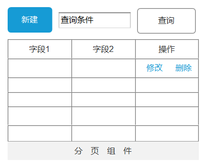

### 单表B型

上部分是一行的查询条件，下部分的显示表格。

查询条件可以有多个，点击“查询”按钮，刷新页面。

查询条件左边是“新建”按钮，点击后弹出新建抽屉框。

表格的最后一列是操作，包括“修改”、“删除”按钮。

后端操作一共有五个：查询、新建、修改、删除、保存。

### 单表C型

在表格中，进行行内编辑。

操作一共有五个：查询、新建、修改、删除、保存。

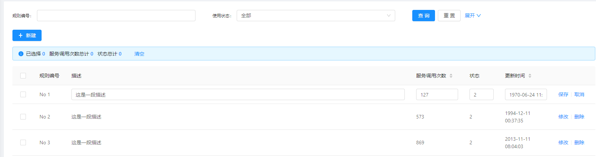

### 树表A型

对于树形表，页面分为左右两部分。左侧部分显示树以及针对树的操作。点击左侧树节点的时候，右侧显示节点详情信息，节点的上级节点是不能在表单中修改的。点击“新增”按钮，可以弹出输入框或者右侧抽屉框，完成输入。

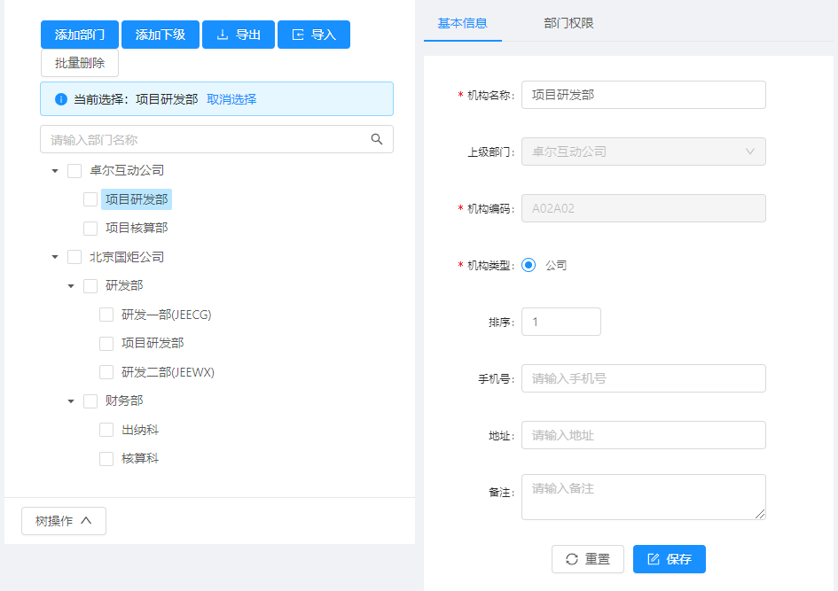

### 树表B型

使用表格，显示树表的数据。

当新增/修改时，可以对上级节点选择。

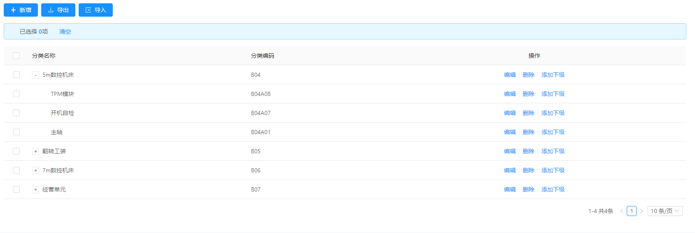

### 主从表A型

主表是普通样式。

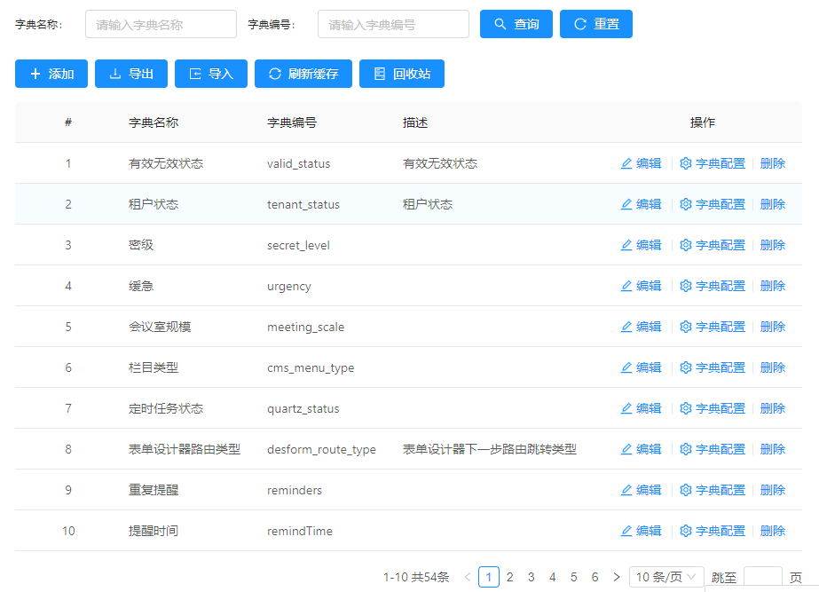

当点击表格右侧的按钮时，弹出抽屉框，对从表增删改查。

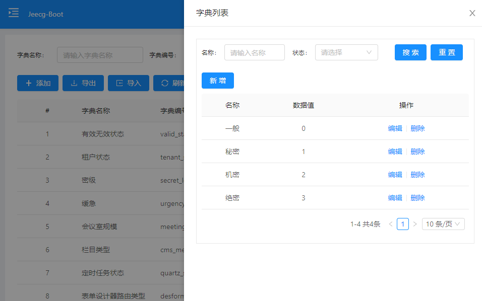

### 主从表B型

当一个主表关联多个从表时，可以在抽屉框中，使用多个tab处理。

# 应用开发

## 页面控件

单行文本

多行文本

图片选择

文件选择

下拉列表框

下拉树框

下拉表格框

多选框

单选框

角色选择框

部门选择框

省市级联

日期框

时间框

日期时间框

### 校验规则

非空

长度

### 按钮操作

新增

修改

删除

查询

主从查询

## 页面结构

整体是左侧导航菜单，右侧操作显示区。右上角有登陆者的个人信息设置，常见的修改密码之类的即可。

点击左侧菜单时，右边以页签形式显示内容。页面可以关闭、可以刷新。“首页”页签不能关闭。

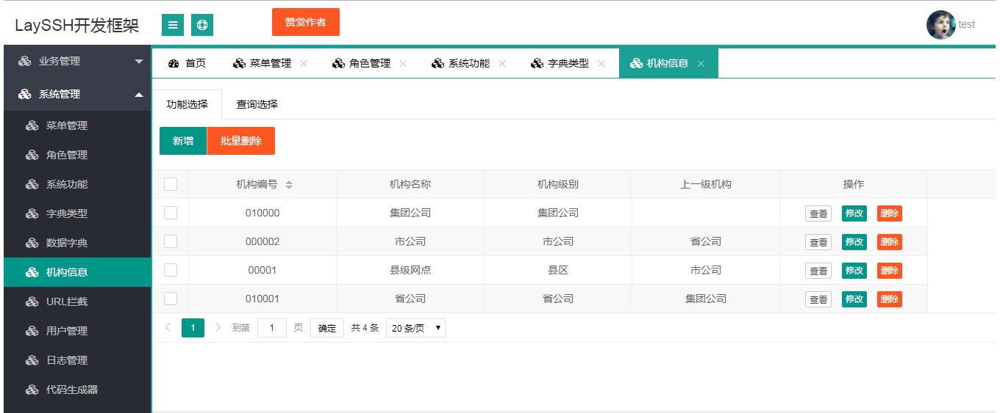

### 表格A型

中间是分页表格，上面是操作按钮，有简单的查询功能。表格中每行右边是操作，如编辑、删除功能。可以批量删除。

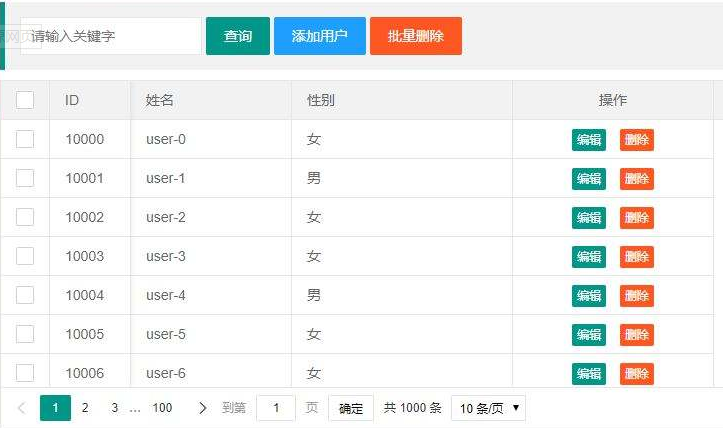

当点击新增、修改按钮，出现弹出框，完成增加、修改内容后，刷新表格。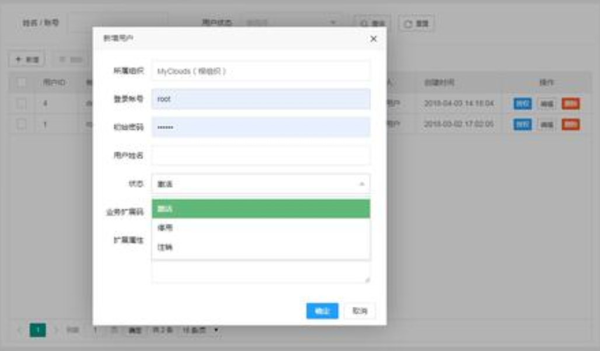

### 表格B型

与A型的区别是表格内第一列是按照树状结构显示。其余与A型相同。

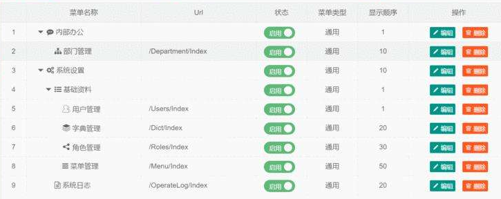

### 左树右表A型

左边是树结构，右边是表格A型。左侧树关联右侧表格。点击左侧树节点，右侧表格内容自动刷新。

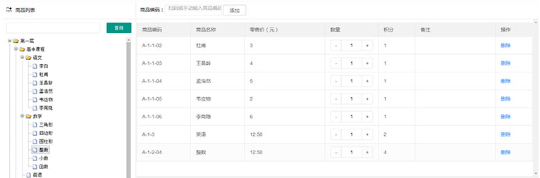

### 统计图A型

页面包含多个内容，上部分是统计数字，下部分是多个图表。数值前面的图标不能必须不同。

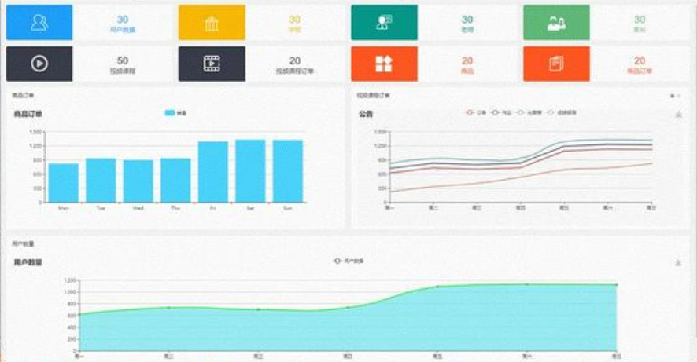

### 统计图B型

显示一副统计图，有可能是柱状图、折线图，有可能是饼图。使用echarts即可。

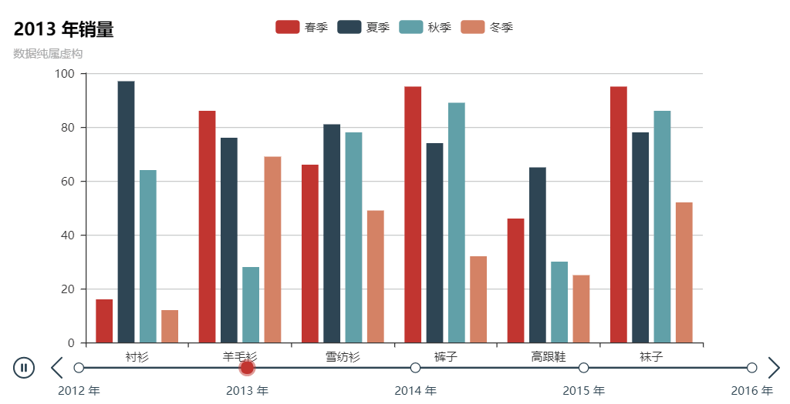

## 资源管理

管理可访问资源，菜单分为顶级菜单、左侧菜单、页面按钮，一共三层。

开发一个新功能时，需要先配置菜单。

## 控件字典

比如单行文本框、多行文本框、下拉表、下拉树、弹出框、抽屉框、主从表等等。

## 校验规则

当用户输入的时候，需要校验一些规则，比如非空、必须数字、手机格式、邮箱格式、长度要求等等。可以定制这种规则，在配置页面的时候勾选即可。复杂的情况，是自定义校验规则，需要用户自己实现代码。

## 页面模板

把一些常用的页面样式，做成模板。不同的模板，有不同的配置参数。在用户使用的时候，只需要配置好这些参数即可。

# 基础设置

## 登录/找回密码

最起码的功能，不详述。==不需要注册功能==。

支持用户名、邮箱、QQ、微信登录。

密码找回，支持邮箱、手机号找回密码。

## 资源管理

描述：指的是页面、按钮等系统功能点，用于权限控制。字段包括：功能名称、url、菜单/按钮、启用/停用、显示顺序等。

功能：支持增删改查。

设计：左树右表A型。左侧显示菜单，右侧显示下级菜单或者页面内按钮。

## 部门和员工管理

部门和员工，可以设置在一个操作界面。左侧时部门树，可以增删改；右侧是部门对应的员工。

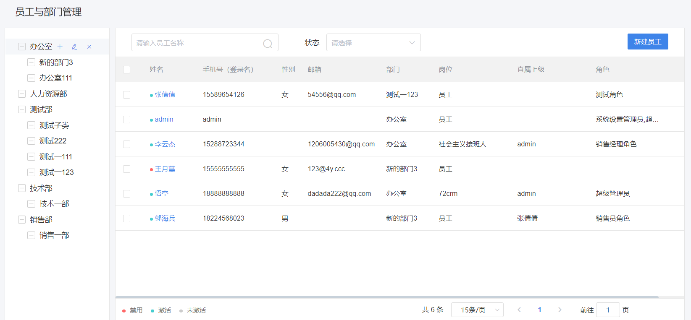

点击姓名时，会弹出抽屉框，进行员工信息的编辑。

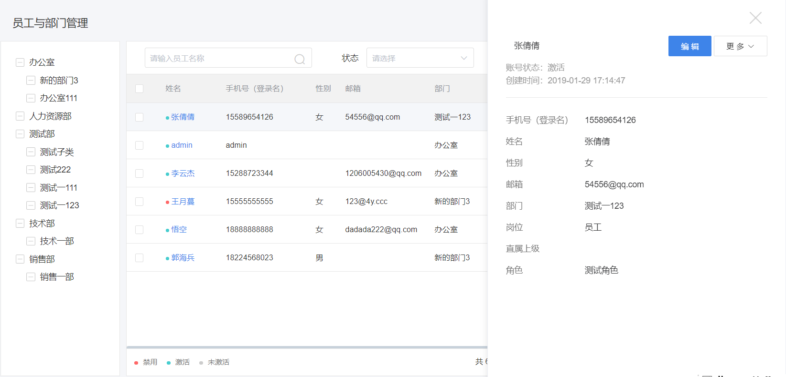

## 岗位和权限管理

角色没有继承关系，角色关联员工，角色具有权限。

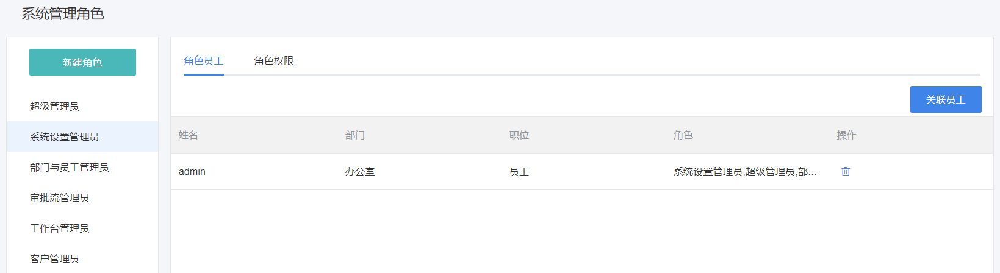

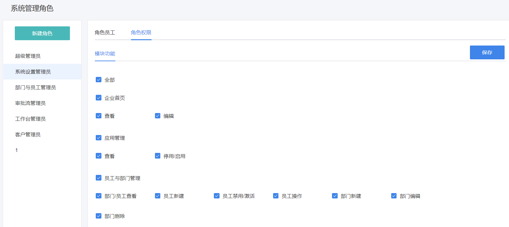

如果角色很多，那么可以分为多个菜单，或者使用tab控制。

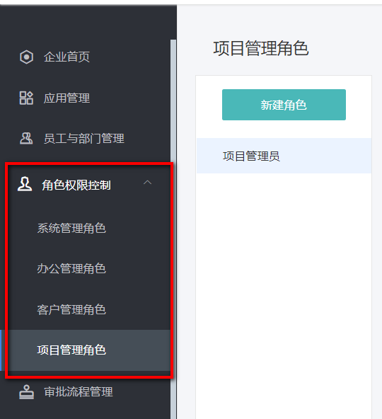

# 教务设置

## 班级管理

描述：对班级进行管理。字段包括：班级名称、班主任ID、导员ID、机构ID、开课日期、结课日期、正常/关闭。

功能：对班级增删改查。关联班主任，一个班主任可以带多个班级。

设计：表格A型。

## 学籍管理

描述：对学生与班级进行关联操作。一个学生对应多个班级。班级与学生是多对多关系。学生可以选班、留级、退学。

功能：对班级关联学生可以增删。

设计：左树右表A型。左侧显示班级，右侧显示学生。

## 访谈管理

描述：对每个学生的跟踪过程记录。包括：学生ID、访谈日期、关键词、访谈内容等。

功能：能够对访谈内容增、查，根据学生、关键字查询。

设计：表格A型。

## 奖惩管理

描述：记录员工或者学生的奖惩细则，奖惩细则是可以发送通知的。可以发送指定接收范围的通知，也可以发送私信。字段包括：奖惩类型(喜报、批评)、标题、影响分数、部门ID、人员ID、奖惩内容、是否阅读、发送人ID、发送日期；还有一个表，记录阅读人数。

功能：对奖惩增删改查；并能够查看谁阅读了通知，谁没有阅读。还有个分数记录表，记录分数变动过程。

设计：表格A型。

# 教学设置

## 课程管理

描述：对课程进行管理。字段包括：课程名称、启用时间、停用时间、描述等。

功能：增删改查。

设计：表格A型。

## 教案管理

描述：一个课程，包括很多章，每一章包含很多节，每一节包含教案。所谓教案就是一个文本编辑器。字段包括：名称、课程ID、章ID、教案内容、授课时长(单位是小时)等。

功能：对章节增删改查。如果是“章”则管理课程ID，如果是“节”，管理章ID，并且有文本编辑器，可以上传图文音视频。

设计：左树右表A型。左侧显示课程、章、节的树状信息。右侧显示章节信息。当左侧点击节时，右侧显示教案内容。

## 教学计划

描述：一个班级，按照日期，学习不同的课程。字段包括：班级ID、课程ID、开始日期、结束日期。

功能：班级关联课程，可以增删。

设计：左树右表A型。左侧显示班级。右侧显示课程信息。当左侧点击班级时，右侧按照日期显示课程。

## 排课管理

描述：一个班级的一个课程，可以由多个讲师授课。讲师与课程是多对多关系。字段包括：班级ID、课程ID、教师ID。还要有个排课显示表格。

功能：班级中的课程关联教师，可以增删。

设计：左树右表A型。左侧显示教师。右侧显示班级授课信息。当左侧点击教师时，右侧显示班级课程。

## 题库管理

描述：按照教案结构，录入题目。字段包括：教案章ID、教案节ID、题目类型（选择、判断、填空、简答、编程）、难度（易、中、难）、题干、选项（可能是图文）、参考答案。

功能：对题目增删改查。

设计：左树右表A型。左侧显示课程、章、节的树状信息。右侧显示题库信息。当左侧点击节时，右侧显示对应的题库。

## 考试管理

描述：包含组卷功能和考试设置。有两个表，包括：试卷名称、试卷类型、题目数量、总分、对应班级、开考时间、结束时间等。

功能：对试卷增删改查，能够自动组卷、设置考试时间和对应班级，考题来自于题库。能够预览试卷。

设计：表格A型

## 监考管理

描述：在学生答卷的过程中，系统要记录学生对题目的浏览顺序、停留时长、答题情况，并可以开启摄像头记录答题人的音视频画面。并随机截屏、拍照。

## 阅卷管理

描述：根据学生的答题情况，给出分数。

功能：包含自动判断、人工判断功能，最后生成阅卷结果。

设计：表格A型

# 学习设置

## 直播管理

## 视频管理

## 笔记管理

# 监控设置

能够观看直播、举手、截屏、访问操作系统进程、访问浏览器历史记录。

## 截屏管理

## 进程管理

## 浏览历史管理

# 报表设置

## 教育概况

描述：汇总显示教育概况，包括班级总数、学生总数、男生人数、女生人数、课程总数、讲师总数。

## 就业概况

描述：汇总显示就业概况。包括有：正在就业班级、就业薪资、就业率、已就业人数、未就业人数等。

## 授课进度

描述：所有正在上课的班级的教学进度。

## 学生成绩

描述：查询每个学生的奖惩情况、每次日评、周考、阶段考的成绩情况、班主任的平时跟踪情况。

## 学生足迹

描述：按照日期，对学生的每一项活动进行记录，并显示出来。可以按照学生、日期、类型、关键字查询。

## 学生画像

描述：根据学生足迹，对学生画像，主要从背景、成绩、就业能力三个大的维度画像。

